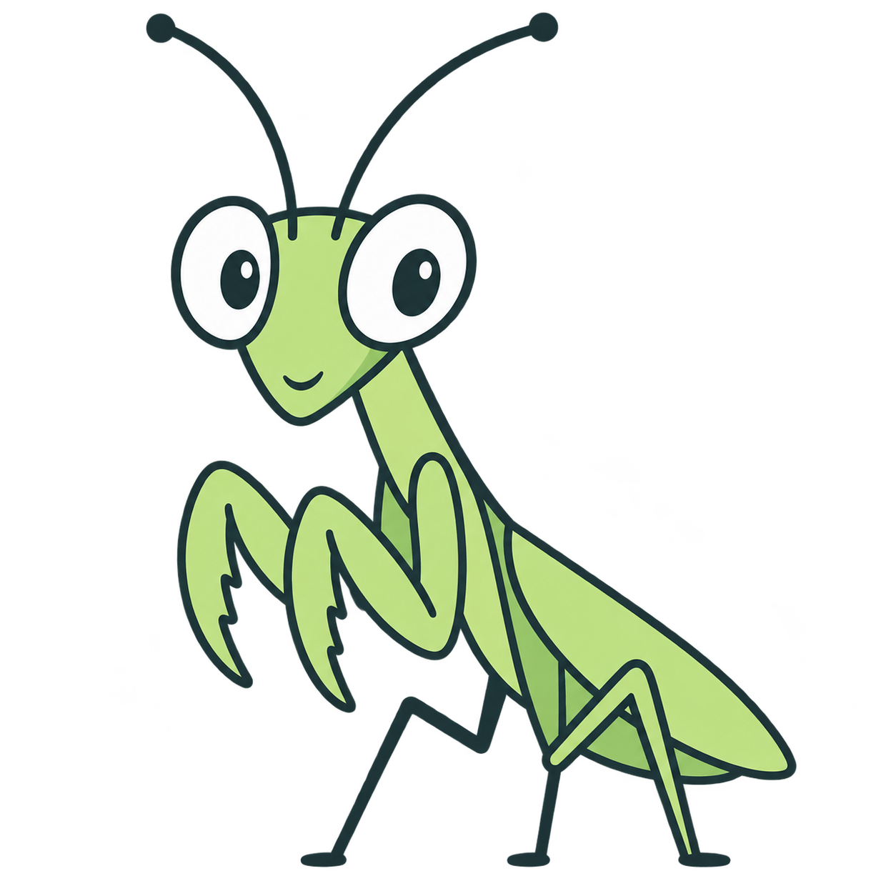
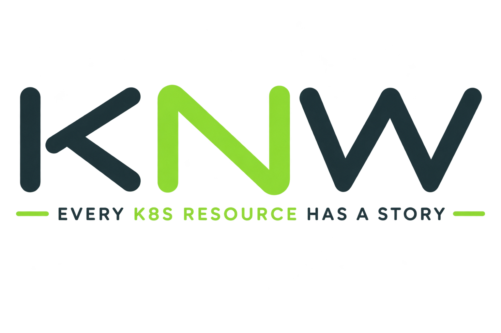

<p align="center">
  
</p>
<p align="center">
  
</p>

<h1 align="center">KNW — Know the story of your kubernetes resources</h1>

<p align="center"><em>Every K8s Resource Has a Story.</em></p>

KNW is an open-source Kubernetes context and investigation engine. It discovers
the relationships between Kubernetes resources and explains them to humans, so
you can understand not just *what* exists in a cluster, but the *context* around
it.

> **Status: experimental (v0.1).** KNW is early and under active development.
> It is read-only and safe to run against any cluster, but its commands and
> output are still evolving.

Built and maintained by [ContinuumX1 Technologies](https://continuumx1.com).

---

## Why KNW?

Kubernetes tells you *what* exists. A `Pod` has an `ownerReferences` field, a
`Service` has a `selector`, an `Ingress` has a `backend` — but you have to hold
all of that in your head and stitch it together yourself to answer everyday
questions:

- Why does this pod exist, and what created it?
- Which pods does this service actually route to?
- This pod is stuck `Pending` — what is it waiting on?
- This ingress returns 503 — does the service it points at even exist?

KNW turns the raw metadata into an explained, linked view:

```
Pod/payment-api
  controlled-by → ReplicaSet/payment-api-xxxx
                    controlled-by → Deployment/payment-api
  runs-on       → Node/worker-01
```

## What makes it different

KNW is not trying to replace the tools you already use — it solves a different
problem.

| Tool | Its job | KNW's job |
|------|---------|-----------|
| `kubectl` | Query and mutate resources | Explain how resources relate |
| k9s | Interactive cluster navigation | Context and investigation |
| Prometheus / Grafana | Metrics and dashboards | Relationships, not metrics |
| ArgoCD | "Does live match Git?" (GitOps sync) | "What's the story around this resource?" |

Unlike a GitOps or dashboard tool, KNW needs only your kubeconfig, works on
**any** resource whether or not it was deployed through a pipeline, and is
strictly **read-only** and **local-first** — it never mutates your cluster and
sends nothing anywhere.

## Installation

KNW requires **Go 1.26+** and a working kubeconfig.

From source:

```bash
git clone https://github.com/continuumx1/knw.git
cd knw
go build -o knw ./cmd/knw
./knw
```

Or install the binary onto your `PATH`:

```bash
go install github.com/continuumx1/knw/cmd/knw@latest
```

> Distribution via `apt`, Homebrew, and prebuilt release binaries is planned but
> not yet available.

## Quick start

KNW uses your current kubeconfig context and its namespace.

```bash
# Show cluster connection info
knw

# Explain a single resource and what surrounds it
knw inspect pod/payment-api
knw inspect service/payment-api
knw inspect ingress/payment-api

# Map every resource KNW understands in a namespace
knw map
knw map kube-system
```

## Example

Investigating a single pod:

```
$ knw inspect pod/knw-demo

POD/knw-demo

CONTEXT

Origin
  └── Directly created

Owner
  └── None

References
  └── ConfigMap/knw-demo-config

Mounts
  └── Secret/knw-demo-missing (not found)

Runs on
  └── Node/minikube

Status
  └── Pending
```

At a glance: this pod is stuck `Pending` because it mounts a `Secret` that does
not exist. KNW only writes `(not found)` after actually checking the API and
confirming the resource is absent — it never guesses.

Mapping a whole namespace:

```
$ knw map

NAMESPACE/default

WORKLOADS
└── Deployment/nginx
    └── ReplicaSet/nginx-56c45fd5ff
        └── Pod/nginx-56c45fd5ff-2cslb  (runs-on Node/minikube)

NETWORKING
└── Service/nginx
    └── selects Pod/nginx-56c45fd5ff-2cslb
└── Ingress/broken
    └── routes-to Service/does-not-exist (not found)

CONFIG & STORAGE
└── ConfigMap/nginx-config
└── PersistentVolumeClaim/data
    └── bound-to PersistentVolume/pvc-abc123
```

## Architecture

The **context engine is the core product; the CLI is only its first interface.**
Resources are modelled as a graph and kept decoupled from how they are rendered.

```
Kubernetes API
      │
      ▼
 kubernetes client  ──►  resolvers  ──►  Context  ──►  renderer  ──►  CLI
 (internal/kubernetes)  (internal/graph)          (internal/render) (cmd/knw)
```

- **`internal/graph`** — the engine: a kind-agnostic `ResourceRef`, a typed
  `Relation`, per-kind resolvers that turn API objects into relationship edges,
  and a `Context` that aggregates a subject's relations with the verified
  existence of the nodes they point at.
- **`internal/render`** — turns a `Context` into human-readable output.
- **`internal/explain`** — thin wiring between the CLI and the engine.
- **`cmd/knw`** — the command-line entry point.

## Relationship model

Relationships are named for their **Kubernetes semantics**, not for convenience.

| Relationship | Meaning | Source |
|--------------|---------|--------|
| `controlled-by` | A resource is controlled by its owner | `ownerReferences` |
| `runs-on` | A Pod is scheduled onto a Node | `pod.spec.nodeName` |
| `selects` | A Service selects Pods | `service.spec.selector` |
| `routes-to` | An Ingress routes to a Service | ingress backends |
| `references` | A Pod consumes config via the environment | `env` / `envFrom` |
| `mounts` | A Pod mounts config as a volume | `volumes` |
| `claims` | A Pod claims a PersistentVolumeClaim | `volumes[].persistentVolumeClaim` |
| `bound-to` | A PVC is bound to a PersistentVolume | `pvc.spec.volumeName` |

A key principle: KNW distinguishes **facts** it read from the API from
references it could not verify. A target that was checked and found missing is
shown as `(not found)`; one that was never verified is shown plainly.

## Current limitations

- **`inspect` supports Pod, Service, and Ingress.** Other kinds are mapped by
  `knw map` but not yet available as a `inspect` subject.
- **No `--namespace` flag on `inspect`** — it uses the current context's namespace.
  Only `map` takes an explicit namespace argument.
- **No custom resources (CRDs) yet** — only the built-in kinds listed above.
- **No change / history / GitOps awareness** — KNW explains the current state,
  not what changed or why it changed.

## Roadmap

**Current**

- Relationship engine with a structured `Context`
- `knw inspect` for Pod, Service, Ingress
- `knw map` for whole-namespace resource graphs
- Verified dangling-reference detection

**Planned**

- More `inspect` subjects (Deployment, StatefulSet, PVC, …)
- A consistent `--namespace` flag
- Reverse lookups (e.g. which pods use this ConfigMap)
- Structured/JSON output for scripting

**Future**

- Change detection and correlation (Git, GitOps, Helm)
- Custom resource (CRD) support
- Additional interfaces beyond the CLI

Priorities evolve from real use; nothing above is a commitment.

## Development

```bash
go build ./...     # build
go test ./...      # run tests
go vet ./...       # static checks
gofmt -l .         # formatting (should print nothing)
```

Relationship resolution is the core logic and is covered by unit tests using a
fake Kubernetes client, so most behaviour can be verified without a live
cluster.

## Contributing

Contributions are welcome. Please keep changes small and focused, follow
[Conventional Commits](https://www.conventionalcommits.org/), and include tests
for new relationship logic. Contribution and security-reporting guidelines will
be added as the project grows.


## License

KNW is licensed under the [Apache License 2.0](LICENSE).

Copyright 2026 ContinuumX1 Technologies Private Limited.

The KNW name, logo, and mascot are trademarks of ContinuumX1 Technologies and
are not covered by the software license. See [NOTICE](NOTICE).
