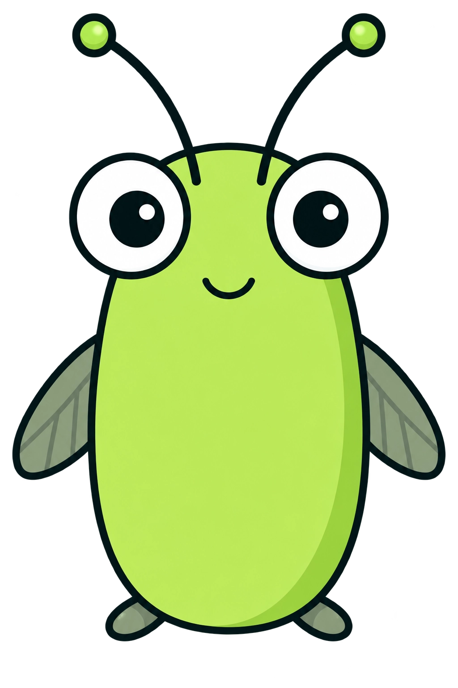

<p align="center">
  
</p>
<p align="center">
  
</p>

<h1 align="center">Mantis — Visual Kubernetes Topology, No Guesswork</h1>

<p align="center"><em>Connect all the dots in your cluster.</em></p>

<p align="center">
  <a href="https://discord.gg/ZTB4eGfCxa"><strong>💬 Join the Discord</strong></a>
  ·
  <a href="docs/USER_GUIDE.md">📖 User Guide</a>
</p>

Mantis is an open-source Kubernetes context and investigation tool with an
interactive web UI. Point it at a cluster and it discovers how your resources
relate to each other, and draws that as a live, explorable graph — so you see
not just *what* exists, but the *story* connecting it.

> **Status: Public Preview.** Mantis is functional and strictly read-only —
> safe to point at a real cluster — but its login flow, UI, and interfaces
> are still evolving ahead of a stable release. See the
> [User Guide](docs/USER_GUIDE.md) for exactly what "Public Preview" means
> for security and access.

Built and maintained by [ContinuumX1 Technologies](https://continuumx1.com).

---

## Why Mantis?

Kubernetes tells you *what* exists. A `Pod` has an `ownerReferences` field, a
`Service` has a `selector`, an `Ingress` has a `backend` — but you have to hold
all of that in your head and stitch it together yourself to answer everyday
questions:

- Why does this pod exist, and what created it?
- Which pods does this service actually route to?
- This pod is stuck `Pending` — what is it waiting on?
- This ingress returns 503 — does the service it points at even exist?

Mantis turns raw metadata into an explained, linked graph: every resource is a
node, every relationship is a typed edge, and namespaces are drawn as regions.
References that point at something which doesn't exist are flagged, not
hidden — Mantis checks, it doesn't guess.

## What makes it different

Mantis isn't trying to replace the tools you already use — it solves a
different problem.

| Tool | Its job | Mantis's job |
|------|---------|-----------|
| `kubectl` | Query and mutate resources | Explain how resources relate |
| k9s | Interactive cluster navigation | Context and investigation |
| Prometheus / Grafana | Metrics and dashboards | Relationships, not metrics |
| ArgoCD | "Does live match Git?" (GitOps sync) | "What's the story around this resource?" |

Mantis works on **any** resource whether or not it was deployed through a
pipeline, is strictly **read-only** — it never mutates your cluster — and
runs on **any** Kubernetes distribution (minikube, kind, kubeadm, RKE2, EKS,
GKE, AKS, …) because it talks to the standard Kubernetes API, never to a
specific distro.

## How it works

Mantis runs as **two small services**, plus your browser — no database, no
extra storage. Every graph you see is built live from a fresh read of the
Kubernetes API.

```
 Your browser
      │  same-origin HTTP (no CORS)
      ▼
 ┌───────────────┐   /api/*  reverse    ┌───────────────┐   client-go /     ┌──────────────────┐
 │  mantis-web   │  ── proxy ─────────► │ mantis-engine │ ── dynamic ─────► │ Kubernetes API   │
 │  (frontend)   │                      │  (backend)    │    client         │  server          │
 │  UI + login   │ ◄── graph JSON ───── │  read-only    │ ◄── objects ───── │                  │
 └───────────────┘                      └───────────────┘                   └──────────────────┘
   exposed to you                          never exposed —
   (Ingress / LoadBalancer)                private ClusterIP only
```

1. Your browser loads the UI from **`mantis-web`** and signs in.
2. The page asks `mantis-web` for the graph; `mantis-web` proxies that
   straight to **`mantis-engine`** — your browser never talks to the engine
   or to Kubernetes directly.
3. `mantis-engine` reads the cluster (via its Pod's ServiceAccount, or your
   kubeconfig when run locally), resolves relationships between what it
   finds, and returns a compact JSON graph.
4. The UI renders it, and re-polls on an interval you control from the
   header (down to every 3 seconds, or manual).

Because only `mantis-web` needs to be reachable, `mantis-engine` can stay a
private, internal-only service with no exposure at all.

```
cmd/
  mantis-engine/      backend service entry point (main.go)
  mantis-web/         frontend service entry point (main.go)
internal/
  graph/              relationship model — ResourceRef, typed Relation,
                       resolvers, Context, and the whole-cluster graph builder
  engine/              backend: graph JSON projection (dto.go) + HTTP handlers
                       (server.go): /api/graph, /api/resource, /healthz, /readyz
  web/                 frontend: embedded UI, login gate, /api reverse-proxy
    ui/                the interactive graph (single-page, no external assets)
  kubernetes/          read-only client (in-cluster ServiceAccount OR kubeconfig)
  httpx/               shared HTTP serving (graceful shutdown, env config)
build/
  Dockerfile.engine    backend image (distroless, nonroot)
  Dockerfile.web       frontend image (distroless, nonroot)
```

For the full picture — every UI feature, the security/permissions model, and
troubleshooting — see the **[User Guide](docs/USER_GUIDE.md)**.

## Quick start (run it on your own machine)

**Requirements:** Go 1.26+, and a Kubernetes cluster your `kubectl`/kubeconfig
already works against — any distribution (minikube, kind, a real cluster,
whatever you've got).

```bash
git clone https://github.com/continuumx1/mantis.git
cd mantis

# 1. Backend — reads your cluster via your local kubeconfig, no setup needed
MANTIS_ENGINE_ADDR=":8080" go run ./cmd/mantis-engine

# 2. Frontend — in a second terminal, serves the UI and proxies /api to the backend above
MANTIS_WEB_ADDR=":8081" MANTIS_ENGINE_URL="http://localhost:8080" go run ./cmd/mantis-web
```

Then open **<http://localhost:8081>** in your browser.

- You'll land on a login screen first — this Public Preview build sits
  behind one. Sign in with the demo credential shown right there on the
  screen (`admin` / `admin`). This is a temporary preview gate, not real
  auth — see the [User Guide](docs/USER_GUIDE.md#public-preview-notes) for
  what that means.
- You'll then see a live graph of whatever cluster your kubeconfig points
  at. **Click** a resource for its details and relationships, **drag** to
  rearrange, **scroll** to zoom, **Ctrl F** to search.

Nothing here is cluster-specific — both ports, and the `localhost` URL, are
just this example; use whatever's free on your machine.

## Configuration

Both services are configured entirely through environment variables.

| Service | Env var | Default | Meaning |
|---------|---------|---------|---------|
| `mantis-engine` | `MANTIS_ENGINE_ADDR` | `:8080` | listen address |
| `mantis-engine` | `MANTIS_SHOW_ALL` | `false` | include system-managed ConfigMaps/Secrets |
| `mantis-web` | `MANTIS_WEB_ADDR` | `:8080` | listen address |
| `mantis-web` | `MANTIS_ENGINE_URL` | `http://mantis-engine:8080` | engine base URL to proxy `/api` to |

Endpoints:

- `mantis-engine`: `GET /api/graph`, `GET /api/resource`, `GET /healthz` (liveness), `GET /readyz` (readiness)
- `mantis-web`: `GET /` (UI), `GET /login`, `GET /api/*` (proxied to the engine), `GET /healthz`

## Running in a cluster

```bash
helm install mantis ./charts/mantis --namespace mantis --create-namespace
```

The **[Helm chart](charts/mantis)** deploys both services: `mantis-engine`
with the read-only ClusterRole/ClusterRoleBinding it needs (exposed only
as a `ClusterIP`, never publicly), `mantis-web` pointed at it, and
everything that goes with them (probes, security contexts, an optional
Ingress). Images pull straight from
[`cx1tech/mantis`](https://hub.docker.com/r/cx1tech/mantis) on Docker Hub
by default — multi-arch (`linux/amd64` + `linux/arm64`), built from a
distroless nonroot base, no local build required. See
**[charts/mantis/README.md](charts/mantis/README.md)** for exposing it
(Ingress/LoadBalancer/port-forward) and the full values reference. Full
detail on the required permissions and the security model is in the
**[User Guide](docs/USER_GUIDE.md)**.

Images tag as `0.1.0-preview.1`, `0.1.0-preview.2`, … through preview
iterations, then `0.1.0-rc.1`, then `0.1.0` for stable.

Building from source is still one command away if you're working on
Mantis itself — each service has its own multi-stage, distroless,
nonroot Dockerfile:

```bash
docker build -f build/Dockerfile.engine -t mantis-engine:dev .
docker build -f build/Dockerfile.web    -t mantis-web:dev .
```

## Relationship model

Relationships are named for their **Kubernetes semantics**, not for
convenience.

| Relationship | Meaning | Source |
|--------------|---------|--------|
| `controlled-by` | A resource is controlled by its owner | `ownerReferences` |
| `runs-on` | A Pod is scheduled onto a Node | `pod.spec.nodeName` |
| `selects` | A Service selects Pods | `service.spec.selector` |
| `serves` | A Service actually backs a Pod | EndpointSlices |
| `routes-to` | An Ingress routes to a Service | ingress backends |
| `references` | A Pod consumes config via the environment | `env` / `envFrom` |
| `mounts` | A Pod mounts config as a volume | `volumes` |
| `claims` | A Pod claims a PersistentVolumeClaim | `volumes[].persistentVolumeClaim` |
| `bound-to` | A PVC is bound to a PersistentVolume | `pvc.spec.volumeName` |
| `scales` | An HPA/VPA drives a workload's replicas or resources | `scaleTargetRef` / `targetRef` |

A key principle: Mantis distinguishes **facts** it read from the API from
references it couldn't verify. A target that was checked and found missing
is shown as a "not found" node; one that exists is shown plainly.

## Current limitations

- **Whole-cluster snapshot per sync**, not a live stream — the graph
  reflects the cluster as of the last poll (as fast as every 3 seconds).
- **Compact detail.** The detail panel shows what the engine computes today
  (health, storage class, endpoints, …); richer per-resource detail is
  planned.
- **Built-in kinds, plus two specific CRDs.** VerticalPodAutoscaler and
  Karpenter's NodePool are understood specifically (best-effort, only if
  installed); other custom resources aren't mapped into the graph yet.
- **No change/history/GitOps awareness** — Mantis explains current state,
  not what changed or why.
- **One shared view per deployment.** Everyone using one Mantis deployment
  currently sees what its ServiceAccount can see — per-user, RBAC-aware
  access is planned alongside real authentication.

## Roadmap

**Current**
- Relationship engine with a structured `Context`
- Whole-cluster graph as a two-service web application
- Any-distribution support via standard kubeconfig / in-cluster auth
- Verified dangling-reference detection
- Public-preview login gate
- Helm chart (two Deployments, two Services, read-only RBAC)
- Published multi-arch images on Docker Hub (`cx1tech/mantis`)

**Planned**
- CI (build/vet/test/gofmt on every PR)
- Real authentication (delegating to Kubernetes RBAC)
- Richer per-resource detail in the UI
- Live updates (watch) instead of snapshot-on-poll

**Future**
- Change detection and correlation (Git, GitOps, Helm)
- Broader custom resource (CRD) support

Priorities evolve from real use; nothing above is a commitment.

## Development

```bash
go build ./...     # build both services
go test ./...      # run tests
go vet ./...       # static checks
gofmt -l .         # formatting (should print nothing)
```

Relationship resolution is the core logic and is covered by unit tests using
a fake Kubernetes client, so most behavior can be verified without a live
cluster.

## Contributing & community

Contributions are welcome — this project is being opened up for
collaborators, and early feedback shapes it directly. A good place to start:

- **[Join the Discord](https://discord.gg/ZTB4eGfCxa)** — ask questions,
  report what's confusing or broken, or talk through an idea before you
  build it. This is the fastest way to reach the maintainers.
- Read the **[User Guide](docs/USER_GUIDE.md)** first — it covers how Mantis
  works end-to-end, which answers most "how does X work" questions before
  you need to read code.
- Keep PRs small and focused, follow [Conventional Commits](https://www.conventionalcommits.org/),
  and include tests for new relationship logic (see `internal/graph`'s
  existing tests for the pattern — they use a fake Kubernetes client, so no
  real cluster is needed to contribute).

Formal contribution and security-reporting guidelines will be added as the
project grows; until then, the Discord is the place to ask.

## License

Mantis is licensed under the [Apache License 2.0](LICENSE).

Copyright 2026 ContinuumX1 Technologies Private Limited.

The Mantis name, logo, and mascot are trademarks of ContinuumX1 Technologies
and are not covered by the software license. See [NOTICE](NOTICE).
