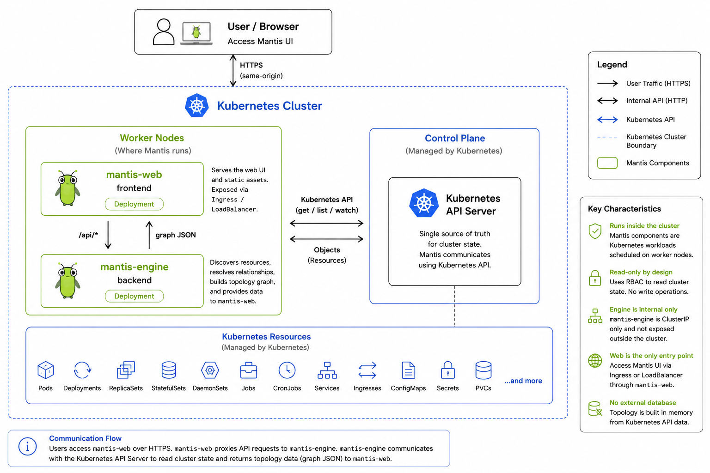

# Architecture

Mantis runs as **two independent services** in your cluster, plus your
browser as the client. There is no database, no separate storage, and no
third component — every graph you see is built live from a fresh read of
the Kubernetes API.

## The two services

**`mantis-engine` (backend)** is the only service that talks to Kubernetes.
On startup it builds a client using its Pod's ServiceAccount token (the
standard in-cluster config); outside a cluster it falls back to your local
kubeconfig, so the exact same binary works as a deployed service or as a
local dev tool. It exposes:

- `GET /api/graph` — the whole cluster, as JSON
- `GET /api/resource` — one resource's YAML manifest, fetched on demand
- `GET /healthz`, `GET /readyz` — liveness/readiness probes

It renders no UI.

**`mantis-web` (frontend)** serves the embedded single-page UI and
reverse-proxies every `/api/*` request straight through to `mantis-engine`.
Your browser only ever talks to `mantis-web`; it never makes a direct
request to the engine or to the Kubernetes API. This is also what lets
`mantis-engine` stay a private `ClusterIP` service with no public exposure
at all — only `mantis-web` needs an Ingress or LoadBalancer.

## What happens on a page load

1. You open the Mantis URL. `mantis-web` checks for a valid session cookie;
   if you don't have one, you're redirected to `/login`.
2. After signing in, the browser loads the single-page app (one HTML
   document with its JS/CSS inlined — no separate asset requests, no CDN).
3. The page calls `GET /api/graph`. `mantis-web` proxies this straight to
   `mantis-engine`.
4. `mantis-engine` walks every namespace (plus cluster-scoped kinds) using
   its Kubernetes client, issuing `list` calls for each resource kind it
   understands (see [Core Concepts](core-concepts.md#resource-kinds)),
   resolves the relationships between what it found (owner references,
   selectors, endpoint slices, volume/env references, …), and assembles an
   in-memory graph.
5. That graph is serialized to JSON and returned. The browser never sees
   raw Kubernetes objects for the graph view — only the derived nodes,
   edges, and the compact display attributes the engine computed
   (readiness, image, probes, resource requests, …).
6. The UI renders the graph as SVG and starts a force-directed layout
   simulation client-side (no server involvement) so nodes settle into
   place and you can drag them around.
7. On an interval you control (see [the sync pill](user-guide.md#staying-in-sync-the-sync-pill)),
   the browser repeats step 3 and re-renders — this is a poll, not a
   push/watch subscription, so what you see is a snapshot as of the last
   sync, not a live stream.
8. If you click a resource and open its **YAML** tab, *that* triggers a
   separate, single, on-demand `GET /api/resource?kind=...&name=...&ns=...`
   call — the engine fetches that one object fresh from the Kubernetes API
   (via the dynamic client, so this also covers CRDs), strips
   server-managed noise (`managedFields`), and returns it as YAML. Nothing
   about YAML fetching happens unless you explicitly open that tab.

## RBAC: what the engine's ServiceAccount needs

`mantis-engine`'s ServiceAccount needs **read-only** (`get`/`list`) access
to the resource kinds it maps — core workloads, networking, storage,
autoscaling objects, Nodes, and (best-effort, only if installed)
VerticalPodAutoscaler and Karpenter NodePool custom resources. It needs no
write verbs on anything, ever — there is no code path in Mantis that issues
a `create`, `update`, `patch`, or `delete` call.

If a `list` for some kind fails with a Forbidden error (RBAC denies it),
Mantis doesn't error out the whole graph: it silently omits that kind and
the graph reflects only what the ServiceAccount could actually read.
Mantis's own visibility is a direct, honest reflection of the permissions
it was granted — nothing more.

The [Helm chart](https://github.com/continuumx1/mantis/tree/main/charts/mantis)
templates exactly this ClusterRole (`charts/mantis/templates/rbac.yaml`) —
every rule in it is commented with the specific Go call that needs it, so
it doubles as a readable audit of what "read-only" actually means here.
