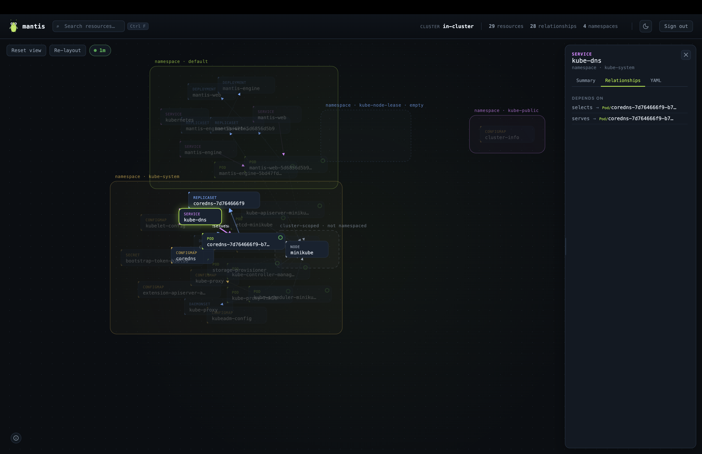

# User Guide

## Signing in

Every Public Preview build sits behind a login screen. Sign in with
**`admin` / `admin`** (the credential is printed on the login screen itself
— see [Public Preview notes](security.md#public-preview-notes) for what
this credential is and isn't). The session lasts 12 hours or until you
sign out.

## The graph canvas

Once signed in, you land on the main graph:

- **Namespace regions.** Each namespace is drawn as a soft, labeled region
  on the canvas; cluster-scoped resources (Nodes, NodePools, …) get their
  own region rather than being forced into a namespace they don't belong
  to. Regions are boundaries for orientation, not hard walls — you can drag
  a node anywhere.
- **Resource cards (nodes).** Each card shows the resource's kind, name,
  and — for Pods — a small status ring: **green** means running/succeeded
  with every container ready; **red** means anything else (crash-looping,
  pending, not-ready containers, …). Other kinds don't carry a health ring
  today (see [Known limitations](troubleshooting.md#known-limitations)).
- **Edges.** A line between two cards is a relationship, drawn as a solid
  line when it points at something that exists, or a **dashed red** line
  when Mantis checked and the target isn't actually there (a dangling
  reference). Hover the legend (bottom-left "i" icon) for the full color
  key — categories (Workload, Pod, Service/Ingress, Config/Secret, Storage,
  Node, Autoscaler) and edge meanings.
- **Pan, zoom, drag.** Scroll/pinch to zoom, drag empty canvas to pan, drag
  a card to reposition it (it stays pinned where you drop it until you
  reload).

## Selecting a resource: the details drawer

Click any card to open the **details drawer** on the right. Here's a
`Service` selected, with its **Relationships** tab open — `selects` and
`serves` edges pointing at the Pod it actually routes to:

The drawer has three tabs:

- **Summary** — the compact, human-readable facts the engine computed for
  that resource: readiness, image, resource requests/limits, probes,
  storage class, endpoints, and similar, kind-specific detail. Anything
  meaningfully absent (no probes configured, no resource requests set) is
  shown as `none` rather than omitted — the gap is often the thing you're
  looking for.
- **Relationships** — every edge touching this resource, in both
  directions, each one clickable to jump straight to the other end.
- **YAML** — the resource's live manifest, fetched fresh from the cluster
  the moment you open this tab (server-managed `managedFields` noise is
  stripped). Secrets show a "hidden for security" message instead of a
  manifest — see [Security](security.md). The YAML view has its own
  **find-in-page search** (the same `Ctrl F` shortcut, scoped to the open
  manifest) with match highlighting and next/previous navigation.

Close the drawer with the ✕ in its header, or press `Escape`.

## Relationship focus and tracing

Selecting a resource doesn't just open its drawer — it also **traces**
outward through the graph a couple of hops and dims everything else: direct
neighbors of the selected resource stay fully visible, resources a couple
of hops further out are dimmed but still legible, and everything unrelated
fades into the background. This is the fastest way to answer "what does
this actually connect to" without hunting across a busy canvas. Selecting
nothing (click empty canvas, or `Escape`) clears the trace and restores
everything.

## Search

Click the search box (or press `Ctrl F`, from anywhere) to search by
resource name or kind. Selecting a result both selects that resource
(opening its drawer and trace) and smoothly flies the camera to center it
on screen — you don't have to manually hunt for it on a large graph.
`Ctrl F` works the same on Windows, Linux, and macOS — it's not Cmd-only or
platform-specific.

## Staying in sync: the sync pill

The pill near the top of the screen shows both *that* Mantis is syncing
with the cluster and *how often*: it always displays the current interval
next to its status dot (`3s`, `10s`, `30s`, `1m`, `5m`), never a vague
"Live" label with no number attached. Click it to change the interval or
switch to **Manual** (no automatic refresh; use the Refresh control
instead). The fastest automatic interval is 3 seconds — anything faster
isn't offered, since polling a whole-cluster read on a very tight loop
isn't a good default for API server load. If the engine can't be reached,
the pill switches to a "Connection lost" state and shows how stale the
displayed data is while it keeps retrying.

Reopening a resource's drawer or YAML tab is preserved across a background
sync — an automatic refresh updates the graph underneath you without
closing whatever you had open.

## Theme

Mantis opens in **dark theme by default**. Toggle to light with the
sun/moon control in the header if you prefer it; the choice is remembered
for the rest of that browser tab (so a reload doesn't flip back to dark
under you) but is not carried over to a new tab or the next time you open
Mantis — it always starts dark.

## Signing out

The **Sign out** control in the header ends your session immediately and
returns you to the login screen.

## Keyboard shortcuts

| Shortcut | Action |
|---|---|
| `Ctrl F` | Focus search (or the YAML find-in-page box, if a YAML tab is open) |
| `Escape` | Close YAML search → close details drawer → clear selection (in that order, one press at a time) |
| `Enter` / `Shift Enter` | Next / previous match, inside YAML find-in-page |
| Scroll / pinch | Zoom the canvas |
| Drag (empty canvas) | Pan |
| Drag (a card) | Reposition that resource |
